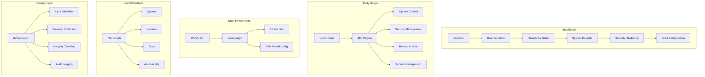

<div align="center">

# 🎪 Dotfiles Flying Circus

### *Your Mac, Automated.*

**Transform a fresh Mac into a fully configured powerhouse with one command.**

[](CHANGELOG.md)
[](https://www.apple.com/macos)
[](docs/CROSS_PLATFORM.md)
[](https://ohmyz.sh/)
[](LICENSE)

---

[**Features**](#-features) •
[**Quick Start**](#-quick-start) •
[**Commands**](#-the-fc-command) •
[**Security**](#-security-hardening) •
[**Documentation**](#-documentation) •
[**Contributing**](#-contributing)

</div>

---

## 🚀 What Is This?

The **Dotfiles Flying Circus** is a comprehensive macOS (and Linux!) automation framework that:

- 🔧 **Configures everything** — 55+ defaults scripts covering system, interface, accessibility, and apps
- 🛡️ **Enterprise-grade security** — 30 security features protecting against privilege escalation, command injection, and more
- 🔐 **Hardens your Mac** — Firewall, FileVault, privacy permissions, APFS snapshots, and security audits
- 📦 **Installs your tools** — Homebrew packages, casks, and App Store apps with verified taps
- 🎯 **Role-based setup** — Different configs for `developer`, `personal`, or `work` machines
- 💾 **Encrypted backups** — Multiple backends: GPG, Restic, Borg with remote sync via rclone
- 🔑 **Secrets management** — 1Password, macOS Keychain, and HashiCorp Vault integration
- 🐧 **Cross-platform** — Full Linux support (Ubuntu, Fedora, Arch) with OS abstraction layer

```
┌─────────────────────────────────────────────────────────────────────────┐
│                                                                         │
│   $ ./install.sh --role developer --privacy-profile lockdown            │
│                                                                         │
│   ✓ Homebrew installed                                                  │
│   ✓ 47 packages installed                                               │
│   ✓ System preferences configured                                       │
│   ✓ Security hardening complete                                         │
│   ✓ Shell environment ready                                             │
│                                                                         │
│   🎉 Your Mac is ready!                                                 │
│                                                                         │
└─────────────────────────────────────────────────────────────────────────┘
```

---

## 🆕 What's New in v1.6 — *The Security & Architecture Release*

<details open>
<summary><strong>🛡️ Complete Security Framework (30 Features)</strong></summary>

This release introduces a comprehensive security hardening library (`lib/security.sh`) with 30 features across 6 categories:

| Category | Features | Highlights |
|----------|----------|------------|
| **Input Validation** | S01-S05 | Path traversal guard, YAML injection prevention, command injection filter, URL validation, package name allowlist |
| **Privilege Protection** | S06-S10 | Sudo audit logging, confirmation prompts, privilege drop, sudoers integrity check, root execution block |
| **File System Security** | S11-S15 | Secure temp files (0600), symlink attack prevention, config permission checks, backup encryption, secure delete |
| **Integrity & Authenticity** | S16-S20 | Config file signing (GPG), script integrity hashes, Homebrew tap verification, self-update signature check, rollback verification |
| **Monitoring & Detection** | S21-S25 | Security event logging, config change detection, failed operation alerting, startup security checks, periodic health reports |
| **Network Security** | S26-S30 | Remote URL allowlist, TLS certificate pinning, network request logging, firewall rule auditor, DNS leak detection |

</details>

<details>
<summary><strong>🔧 7 New FC Commands</strong></summary>

| Command | Description |
|---------|-------------|
| `fc uninstall` | Complete app removal (bundle, preferences, caches, containers) |
| `fc theme` | Shell theme management with dark/light themes |
| `fc network` | Network diagnostics (status, diag, latency, DNS, port check) |
| `fc docker` | Docker cleanup utility with resource management |
| `fc desktop` | Desktop organizer (archive, organize by type, undo) |
| `fc history` | Enhanced shell history search with fzf integration |
| `fc scaffold` | Project scaffolding with template variable substitution |

**Plus enhanced commands:**
- `fc firewall` — Granular per-app rules, stealth mode, block-all mode
- `fc focus` — Distraction-free work sessions with website blocking
- `fc snapshot` — APFS snapshot management for safe rollbacks
- `fc config-audit` — Configuration drift detection

</details>

<details>
<summary><strong>⚡ Infrastructure Improvements</strong></summary>

- **Declarative YAML Configuration** — `fc config` with `apply`, `validate`, `show` commands
- **APFS Snapshot Integration** — Automatic snapshots before major changes
- **Cross-Platform Linux Support** — Ubuntu, Fedora, Arch with OS abstraction layer
- **40+ FC Commands** — Comprehensive system control suite
- **55+ macOS Defaults Scripts** — Complete system customization

</details>

<details>
<summary><strong>📦 Previous Releases (v1.0-v1.5)</strong></summary>

### v1.5: Documentation & Defaults
- New `fc defaults` plugin with 42 curated macOS tweaks
- Complete documentation for all 40+ defaults scripts
- AppleScript reference with 31 copy-paste ready scripts

### v1.4: Role-Specific Settings
- 12 new role-specific configuration files
- Developer: Docker, databases, testing, Kubernetes aliases
- Work: Calendar, Slack, Zoom, Atlassian tools
- Personal: Gaming, media, relaxed security

### v1.3: macOS Defaults Expansion
- 24 new application defaults scripts
- 50+ new settings across 15 scripts
- Privacy and lockdown profile enhancements

### v1.2: System Defaults
- 11 new system and interface defaults scripts
- Spotlight, Sharing, AirDrop, Network, Siri, Focus Modes

### v1.1: Alfred & Raycast Integration
- `fc alfred` with 12 keyword triggers
- `fc raycast` with 27 script commands
- VM management with Lima/Colima support

### v1.0: Initial Release
- 30+ fc commands with plugin architecture
- Role-based installation (developer, personal, work)
- Multiple backup backends (GPG, Restic, Borg)
- Secrets management (1Password, Keychain, Vault)

</details>

---

## ✨ Features

<table>
<tr>
<td width="50%">

### 🛠️ System Configuration (55+ Scripts)
- **System**: Privacy, energy, sound, Bluetooth, login
- **Interface**: Dock, Finder, menu bar, Control Center
- **Input**: Keyboard, trackpad, gestures
- **Accessibility**: Display, pointer, zoom
- **Apps**: Safari, Mail, Chrome, Slack, Xcode, and 30+ more

</td>
<td width="50%">

### 🛡️ Enterprise Security (30 Features)
- Input validation & command injection protection
- Privilege escalation prevention
- Secure temp files & symlink attack guards
- Config signing & script integrity verification
- Security event logging & anomaly detection
- TLS certificate pinning & DNS leak checks

</td>
</tr>
<tr>
<td width="50%">

### 📦 Package Management
- Homebrew formulae & casks with verified taps
- Mac App Store apps (via `mas`)
- Role-specific Brewfiles (140+ packages)
- Automatic dependency updates
- Orphaned package cleanup

</td>
<td width="50%">

### 🐚 Shell Environment (21 env files)
- Oh My Zsh with custom `circus` plugin
- Language configs: Python, Node, Go, Rust, Java
- DevOps: Docker, Kubernetes, AWS/GCP/Azure
- XDG directory compliance
- 100+ role-based aliases

</td>
</tr>
<tr>
<td width="50%">

### 💾 Backup & Sync
- **3 backends**: GPG, Restic, Borg
- Remote sync via rclone (40+ providers)
- APFS snapshots for instant rollback
- VS Code settings sync
- Encrypted backups with secure delete

</td>
<td width="50%">

### 🎯 Role-Based Setup
- **Developer**: Git aliases, debugging, Xcode, Docker
- **Personal**: Media tools, gaming, relaxed security
- **Work**: Corporate proxy/VPN, Slack, Zoom, Jira
- **Secrets**: 1Password, Keychain, Vault

</td>
</tr>
</table>

---

## 🏃 Quick Start

### One-Line Install

```bash
git clone https://github.com/southpawriter02/circus.git && cd circus && ./install.sh
```

### With Options

```bash
# Developer setup with enhanced privacy
./install.sh --role developer --privacy-profile privacy

# Personal machine with maximum security
./install.sh --role personal --privacy-profile lockdown

# Work machine with standard settings
./install.sh --role work
```

---

## 🎮 The `fc` Command

The heart of the project is the `fc` (Flying Circus) command-line utility — **40+ commands** to control every aspect of your Mac:

```
┌────────────────────────────────────────────────────────────────────────────────┐
│  fc <command> [action]                                                         │
├────────────────────────────────────────────────────────────────────────────────┤
│                                                                                │
│  NETWORK          SECURITY          SYSTEM           PRODUCTIVITY             │
│  ───────          ────────          ──────           ────────────              │
│  wifi             audit             disk             caffeine                  │
│  bluetooth        firewall          info             clipboard                 │
│  dns              lock              update           backup                    │
│  airdrop          encrypt           maintenance      sync                      │
│  network          keychain          healthcheck      schedule                  │
│                   privacy           snapshot         vscode-sync               │
│                   focus             timemachine      desktop                   │
│                                                                                │
│  CONFIGURATION    HARDWARE          DEVELOPMENT      MANAGEMENT               │
│  ─────────────    ────────          ───────────      ──────────                │
│  config           power             gpg-setup        dotfiles                  │
│  config-audit     audio             ssh              apps                      │
│  defaults         display           docker           profile                   │
│  app-settings     vm                scaffold         uninstall                 │
│                                     history          theme                     │
│                                                                                │
│  INTEGRATIONS     BOOTSTRAP                                                    │
│  ────────────     ─────────                                                    │
│  alfred           bootstrap                                                    │
│  raycast          secrets                                                      │
│  applescript      clean                                                        │
│  notify                                                                        │
│                                                                                │
└────────────────────────────────────────────────────────────────────────────────┘
```

### Command Highlights

```bash
# 🔒 Run a security audit
fc audit run
# Output: Checks SIP, FileVault, Gatekeeper, Firewall... gives you a score!

# 📊 Analyze disk usage
fc disk usage ~/Downloads
fc disk cleanup  # Interactive cleanup wizard

# 🔑 Generate SSH key (auto-adds to keychain, copies to clipboard)
fc ssh generate

# ☕ Keep Mac awake
fc caffeine on           # Indefinitely
fc caffeine for 60       # For 60 minutes

# 🌐 Switch DNS servers
fc dns set 1.1.1.1 1.0.0.1  # Cloudflare
fc dns set 8.8.8.8 8.8.4.4  # Google

# 💾 Encrypted backup with multiple backends
fc sync backup              # GPG-encrypted backup (default)
fc sync backup --backend restic  # Deduplicating backup
fc sync push                # Push to remote (S3, Dropbox, etc.)

# 🚀 Bootstrap a new machine
fc bootstrap                # Interactive setup wizard
fc bootstrap --phases all   # Full automated setup

# 🔑 Secrets management
fc secrets sync             # Sync secrets from 1Password/Keychain
fc secrets get op://vault/item/password  # Get specific secret

# 📸 APFS Snapshots for safe rollbacks (NEW in v1.6!)
fc snapshot create "before-update"  # Create snapshot
fc snapshot list                    # View all snapshots

# ⚙️ Declarative configuration (NEW in v1.6!)
fc config apply roles/developer/config.yaml  # Apply YAML config
fc config-audit                              # Detect configuration drift

# 🎯 Focus mode for productivity (NEW in v1.6!)
fc focus start 2h          # Start 2-hour focus session
fc focus status            # Check remaining time

# 🔌 Hardware control (NEW in v1.6!)
fc power switch battery-saver   # Switch power profile
fc audio volume 50              # Set volume to 50%
fc display save-layout work     # Save monitor arrangement
```

---

## 🏗️ Architecture



---

## 📚 Documentation

| Guide | Description |
|-------|-------------|
| [📖 Commands Reference](COMMANDS.md) | Complete `fc` command documentation (40+ commands) |
| [🏛️ Architecture](ARCHITECTURE.md) | System design and philosophy |
| [👥 Roles Guide](ROLES.md) | Role-based installation explained |
| [🛡️ Security Hardening](ROADMAP.md#-security-hardening-priority-0---critical) | 30 security features (S01-S30) |
| [🔐 Privacy Profiles](defaults/profiles/README.md) | Security profile options |
| [🔧 macOS Defaults](defaults/README.md) | 55+ defaults scripts documented |
| [💾 Backup Backends](docs/BACKUP_BACKENDS.md) | GPG, Restic, and Borg options |
| [🔑 Secrets Management](docs/SECRETS.md) | 1Password, Keychain, Vault integration |
| [🚀 Bootstrap Guide](docs/BOOTSTRAP.md) | New machine setup automation |
| [🌐 Cross-Platform](docs/CROSS_PLATFORM.md) | Linux support (Ubuntu, Fedora, Arch) |
| [🎩 Alfred Workflow](docs/ALFRED.md) | Alfred integration for quick access |
| [🔌 Creating Plugins](docs/CREATING_PLUGINS.md) | Extend `fc` with your own commands |
| [🎵 AppleScripts](docs/APPLESCRIPTS.md) | 31 ready-to-use automation scripts |
| [📝 YAML Configuration](docs/YAML_CONFIGURATION.md) | Declarative config system |
| [📋 All Documentation](docs/README.md) | Full documentation index |

---

## 🔒 Privacy Profiles

Choose your security level:

| Profile | Firewall | FileVault | Analytics | Siri | Location |
|---------|----------|-----------|-----------|------|----------|
| **Standard** | ✅ On | ✅ Enabled | ⚡ Limited | ✅ On | ⚡ Apps |
| **Privacy** | ✅ Stealth | ✅ Enabled | ❌ Off | ❌ Off | ⚡ System Only |
| **Lockdown** | ✅ Block All | ✅ Required | ❌ Off | ❌ Off | ❌ Off |

---

## 🛡️ Security Hardening

The framework includes **30 enterprise-grade security features** in `lib/security.sh`:

<details>
<summary><strong>Input Validation & Sanitization (S01-S05)</strong></summary>

| Feature | Description |
|---------|-------------|
| **Path Traversal Guard** | Validates file paths to prevent `../` and symlink attacks |
| **YAML Injection Prevention** | Sanitizes YAML values before `defaults write` or `eval` |
| **Command Injection Filter** | Escapes/validates all user inputs passed to shell commands |
| **URL Validation** | Validates remote URLs, enforces HTTPS |
| **Package Name Allowlist** | Validates brew/cask/mas package names |

</details>

<details>
<summary><strong>Privilege Escalation Protection (S06-S10)</strong></summary>

| Feature | Description |
|---------|-------------|
| **Sudo Audit Logging** | Logs all `sudo` invocations with timestamp and result |
| **Sudo Prompt Confirmation** | Requires `--yes` for destructive operations |
| **Privilege Drop After Use** | Invalidates sudo credentials immediately after use |
| **sudoers Integrity Check** | Detects modifications to `/etc/sudoers` |
| **Root Execution Block** | Refuses to run framework as root |

</details>

<details>
<summary><strong>File System Security (S11-S15)</strong></summary>

| Feature | Description |
|---------|-------------|
| **Secure Temp Files** | Uses `mktemp` with 0600 permissions |
| **Symlink Attack Prevention** | Checks paths before writing (TOCTOU protection) |
| **Config File Permissions** | Warns if config files are world-writable |
| **Backup Encryption** | GPG AES256 encryption for sensitive backups |
| **Secure Delete for Secrets** | Multi-pass overwrite before deletion |

</details>

<details>
<summary><strong>Integrity & Authenticity (S16-S20)</strong></summary>

| Feature | Description |
|---------|-------------|
| **Config File Signing** | GPG-signs config files with detached signatures |
| **Script Integrity Hashes** | SHA256 manifest to detect tampering |
| **Homebrew Tap Verification** | Only allows packages from verified taps |
| **Self-Update Signature Check** | Verifies git commits are GPG-signed |
| **Rollback Verification** | Verifies APFS snapshot integrity before restore |

</details>

<details>
<summary><strong>Monitoring & Detection (S21-S25)</strong></summary>

| Feature | Description |
|---------|-------------|
| **Security Event Logging** | Structured logging to `~/.circus/security_audit.log` |
| **Config Change Detection** | Alerts on unexpected configuration changes |
| **Failed Operation Alerting** | Tracks failures, alerts on threshold exceeded |
| **Startup Security Checks** | Automated audit on framework start |
| **Periodic Health Reports** | Comprehensive security health reports |

</details>

<details>
<summary><strong>Network Security (S26-S30)</strong></summary>

| Feature | Description |
|---------|-------------|
| **Remote URL Allowlist** | Domain verification for downloads |
| **TLS Certificate Pinning** | Pins certificates for update URLs |
| **Network Request Logging** | Logs all network requests made by `fc` |
| **Firewall Rule Auditor** | Baseline and verify firewall rules |
| **DNS Leak Detection** | Verifies expected DNS resolvers |

</details>

---

## 🔄 Machine Migration

Moving to a new Mac? Use the bootstrap command for a complete setup:

```bash
# On your OLD Mac
fc sync backup
fc sync push  # Push to cloud storage (optional)

# On your NEW Mac - Full automated setup
git clone https://github.com/southpawriter02/circus.git && cd circus
fc bootstrap  # Interactive wizard guides you through everything!

# Or step-by-step:
./install.sh --role developer
fc sync restore
# 🎉 You're back in business!
```

---

## 🤝 Contributing

Contributions are welcome! This project uses automated quality checks:

```bash
# Set up development environment
bin/setup-dev

# Pre-commit hooks run automatically:
# ✓ shellcheck - Lint shell scripts
# ✓ shfmt - Format shell scripts  
# ✓ bats - Run test suite
```

See the [Contributing Guide](CONTRIBUTING.md) for details.

---

## 🙏 Inspiration

Standing on the shoulders of giants:

- [Oh My Zsh](https://ohmyz.sh/) — Shell framework
- [Mathias Bynens' dotfiles](https://github.com/mathiasbynens/dotfiles) — macOS defaults
- [Zach Holman's dotfiles](https://github.com/holman/dotfiles) — Modular approach
- [pre-commit](https://pre-commit.com/) — Git hooks framework

---

<div align="center">

**🎪 The Dotfiles Flying Circus**

*Because setting up a Mac should be fun, not work.*

Made with ☕ and 🎲 by [@southpawriter02](https://github.com/southpawriter02)

</div>
