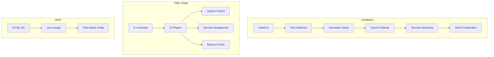

<div align="center">

# 🎪 Dotfiles Flying Circus

### *Your Mac, Automated.*

**Transform a fresh Mac into a fully configured powerhouse with one command.**

[](https://www.apple.com/macos)
[](https://ohmyz.sh/)
[](LICENSE)

---

[**Features**](#-features) •
[**Quick Start**](#-quick-start) •
[**Commands**](#-the-fc-command) •
[**Documentation**](#-documentation) •
[**Contributing**](#-contributing)

</div>

---

## 🚀 What Is This?

The **Dotfiles Flying Circus** is a comprehensive macOS automation framework that:

- 🔧 **Configures everything** — Dock, Finder, keyboard, security, and 50+ system preferences
- 🔐 **Hardens your Mac** — Firewall, FileVault, privacy permissions, and security audits
- 📦 **Installs your tools** — Homebrew packages, casks, and App Store apps
- 🎯 **Role-based setup** — Different configs for `developer`, `personal`, or `work` machines
- 💾 **Encrypted backups** — Sync your entire setup with GPG encryption

```
┌─────────────────────────────────────────────────────────────────────────┐
│                                                                         │
│   $ ./install.sh --role developer --privacy-profile lockdown            │
│                                                                         │
│   ✓ Homebrew installed                                                  │
│   ✓ 47 packages installed                                               │
│   ✓ System preferences configured                                       │
│   ✓ Security hardening complete                                         │
│   ✓ Shell environment ready                                             │
│                                                                         │
│   🎉 Your Mac is ready!                                                 │
│                                                                         │
└─────────────────────────────────────────────────────────────────────────┘
```

---

## ✨ Features

<table>
<tr>
<td width="50%">

### 🛠️ System Configuration
- Dock: position, size, auto-hide, app behavior
- Finder: show hidden files, path bar, extensions
- Keyboard: key repeat, modifier keys, shortcuts
- Trackpad: gestures, click behavior, scrolling
- Screenshots: location, format, shadows

</td>
<td width="50%">

### 🔐 Security & Privacy
- Firewall configuration with stealth mode
- FileVault encryption management
- Privacy permission auditing
- Gatekeeper settings
- Screen lock & password policies

</td>
</tr>
<tr>
<td width="50%">

### 📦 Package Management
- Homebrew formulae & casks
- Mac App Store apps (via `mas`)
- Role-specific Brewfiles
- Automatic dependency updates

</td>
<td width="50%">

### 🐚 Shell Environment
- Oh My Zsh framework
- Custom `circus` plugin
- Role-based aliases & functions
- GPG & SSH key management

</td>
</tr>
<tr>
<td width="50%">

### 💾 Backup & Sync
- GPG-encrypted machine backups
- One-command restoration
- Brewfile export/import
- Dotfile timestamped snapshots

</td>
<td width="50%">

### 🎯 Role-Based Setup
- **Developer**: Full dev tools, languages, IDEs
- **Personal**: Productivity apps, media tools
- **Work**: Corporate tools, VPN configs
- Custom roles supported

</td>
</tr>
</table>

---

## 🏃 Quick Start

### One-Line Install

```bash
git clone https://github.com/southpawriter02/circus.git && cd circus && ./install.sh
```

### With Options

```bash
# Developer setup with enhanced privacy
./install.sh --role developer --privacy-profile privacy

# Personal machine with maximum security
./install.sh --role personal --privacy-profile lockdown

# Work machine with standard settings
./install.sh --role work
```

---

## 🎮 The `fc` Command

The heart of the project is the `fc` (Flying Circus) command-line utility — **22 commands** to control every aspect of your Mac:

```
┌──────────────────────────────────────────────────────────────────────────┐
│  fc <command> [action]                                                   │
├──────────────────────────────────────────────────────────────────────────┤
│                                                                          │
│  NETWORK          SECURITY          SYSTEM           PRODUCTIVITY       │
│  ───────          ────────          ──────           ────────────        │
│  wifi             audit             disk             caffeine            │
│  bluetooth        firewall          info             clipboard           │
│  dns              lock              doctor           backup              │
│  airdrop          encrypt           update           sync                │
│                   keychain                                               │
│                   privacy                                                │
│                                                                          │
│  DEVELOPMENT                                                             │
│  ───────────                                                             │
│  gpg-setup        ssh-keygen        redis                                │
│                                                                          │
└──────────────────────────────────────────────────────────────────────────┘
```

### Command Highlights

```bash
# 🔒 Run a security audit
fc audit run
# Output: Checks SIP, FileVault, Gatekeeper, Firewall... gives you a score!

# 📊 Analyze disk usage
fc disk usage ~/Downloads
fc disk cleanup  # Interactive cleanup wizard

# 🔑 Generate SSH key (auto-adds to keychain, copies to clipboard)
fc ssh-keygen

# ☕ Keep Mac awake
fc caffeine on           # Indefinitely
fc caffeine for 60       # For 60 minutes

# 🌐 Switch DNS servers
fc dns set 1.1.1.1 1.0.0.1  # Cloudflare
fc dns set 8.8.8.8 8.8.4.4  # Google

# 💾 Encrypted backup for machine migration
fc sync backup   # Creates ~/circus_backup.tar.gz.gpg
fc sync restore  # Restores everything on new machine
```

---

## 🏗️ Architecture



---

## 📚 Documentation

| Guide | Description |
|-------|-------------|
| [📖 Commands Reference](COMMANDS.md) | Complete `fc` command documentation |
| [🏛️ Architecture](ARCHITECTURE.md) | System design and philosophy |
| [👥 Roles Guide](ROLES.md) | Role-based installation explained |
| [🔐 Privacy Profiles](defaults/profiles/README.md) | Security profile options |
| [🔌 Creating Plugins](docs/CREATING_PLUGINS.md) | Extend `fc` with your own commands |
| [🍎 macOS Commands](docs/MACOS_COMMANDS.md) | Terminal commands reference |
| [🎨 Customization](docs/CUSTOMIZATION.md) | Make it your own |
| [📋 All Documentation](docs/README.md) | Full documentation index |

---

## 🔒 Privacy Profiles

Choose your security level:

| Profile | Firewall | FileVault | Analytics | Siri | Location |
|---------|----------|-----------|-----------|------|----------|
| **Standard** | ✅ On | ✅ Enabled | ⚡ Limited | ✅ On | ⚡ Apps |
| **Privacy** | ✅ Stealth | ✅ Enabled | ❌ Off | ❌ Off | ⚡ System Only |
| **Lockdown** | ✅ Block All | ✅ Required | ❌ Off | ❌ Off | ❌ Off |

---

## 🔄 Machine Migration

Moving to a new Mac? It's a two-step process:

```bash
# On your OLD Mac
fc sync backup
# Copy ~/circus_backup.tar.gz.gpg to new machine

# On your NEW Mac
./install.sh --role developer
fc sync restore
# 🎉 You're back in business!
```

---

## 🤝 Contributing

Contributions are welcome! This project uses automated quality checks:

```bash
# Set up development environment
bin/setup-dev

# Pre-commit hooks run automatically:
# ✓ shellcheck - Lint shell scripts
# ✓ shfmt - Format shell scripts  
# ✓ bats - Run test suite
```

See the [Contributing Guide](CONTRIBUTING.md) for details.

---

## 🙏 Inspiration

Standing on the shoulders of giants:

- [Oh My Zsh](https://ohmyz.sh/) — Shell framework
- [Mathias Bynens' dotfiles](https://github.com/mathiasbynens/dotfiles) — macOS defaults
- [Zach Holman's dotfiles](https://github.com/holman/dotfiles) — Modular approach
- [pre-commit](https://pre-commit.com/) — Git hooks framework

---

<div align="center">

**🎪 The Dotfiles Flying Circus**

*Because setting up a Mac should be fun, not work.*

Made with ☕ and 🎲 by [@southpawriter02](https://github.com/southpawriter02)

</div>
