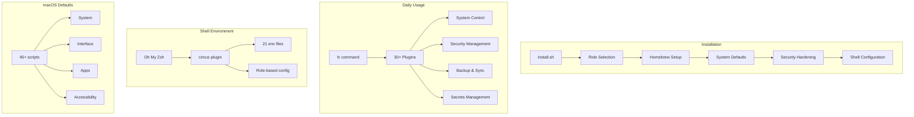

<div align="center">

# 🎪 Dotfiles Flying Circus

### *Your Mac, Automated.*

**Transform a fresh Mac into a fully configured powerhouse with one command.**

[](CHANGELOG.md)
[](https://www.apple.com/macos)
[](https://ohmyz.sh/)
[](LICENSE)

---

[**Features**](#-features) •
[**Quick Start**](#-quick-start) •
[**Commands**](#-the-fc-command) •
[**Documentation**](#-documentation) •
[**Contributing**](#-contributing)

</div>

---

## 🚀 What Is This?

The **Dotfiles Flying Circus** is a comprehensive macOS automation framework that:

- 🔧 **Configures everything** — 45+ defaults scripts covering system, interface, accessibility, and apps
- 🔐 **Hardens your Mac** — Firewall, FileVault, privacy permissions, and security audits
- 📦 **Installs your tools** — Homebrew packages, casks, and App Store apps
- 🎯 **Role-based setup** — Different configs for `developer`, `personal`, or `work` machines
- 💾 **Encrypted backups** — Multiple backends: GPG, Restic, Borg with remote sync via rclone
- 🔑 **Secrets management** — 1Password, macOS Keychain, and HashiCorp Vault integration

```
┌─────────────────────────────────────────────────────────────────────────┐
│                                                                         │
│   $ ./install.sh --role developer --privacy-profile lockdown            │
│                                                                         │
│   ✓ Homebrew installed                                                  │
│   ✓ 47 packages installed                                               │
│   ✓ System preferences configured                                       │
│   ✓ Security hardening complete                                         │
│   ✓ Shell environment ready                                             │
│                                                                         │
│   🎉 Your Mac is ready!                                                 │
│                                                                         │
└─────────────────────────────────────────────────────────────────────────┘
```

---

## 🆕 What's New in v1.0

<details>
<summary><strong>Click to expand v1.0 highlights</strong></summary>

### Shell Environment
- **21 environment files** covering security, telemetry, languages (Python, Node, Go, Rust, Java), DevOps tools (Docker, K8s, AWS/GCP/Azure), and XDG directories
- Enhanced shell profiles with proper Homebrew PATH, credential cleanup on logout
- Centralized PATH management with `path_prepend()` and `path_append()` helpers

### macOS Defaults (45+ scripts)
- **System**: Privacy, Gatekeeper, energy management, sound, Bluetooth, login window
- **Interface**: Menu bar, notifications, desktop, Control Center
- **Applications**: Mail, Messages, Photos, Notes, Warp, JetBrains IDEs
- **Accessibility**: Display, pointer, zoom settings

### Role-Specific Settings
- **Developer role**: 100+ git aliases, development env, debugging helpers, Xcode defaults
- **Work role**: Corporate proxy/VPN settings, stricter security, work-specific aliases
- **Personal role**: Media aliases, relaxed security, entertainment tools

### Commands & Features
- **30+ fc commands** including `bootstrap`, `secrets`, `vscode-sync`, `maintenance`, `healthcheck`
- **Multiple backup backends**: GPG, Restic, Borg with remote sync via rclone
- **Secrets management**: 1Password, macOS Keychain, HashiCorp Vault integration
- **Bootstrap wizard**: Complete new machine setup with interactive or automated modes

</details>

---

## ✨ Features

<table>
<tr>
<td width="50%">

### 🛠️ System Configuration (45+ Scripts)
- **System**: Privacy, energy, sound, Bluetooth, login
- **Interface**: Dock, Finder, menu bar, Control Center
- **Input**: Keyboard, trackpad, gestures
- **Accessibility**: Display, pointer, zoom
- **Apps**: Safari, Mail, Photos, Notes, and more

</td>
<td width="50%">

### 🔐 Security & Privacy
- Firewall configuration with stealth mode
- FileVault encryption management
- Privacy permission auditing
- Gatekeeper and quarantine settings
- Screen lock & password policies
- Telemetry and analytics blocking

</td>
</tr>
<tr>
<td width="50%">

### 📦 Package Management
- Homebrew formulae & casks
- Mac App Store apps (via `mas`)
- Role-specific Brewfiles
- Automatic dependency updates
- Orphaned package cleanup

</td>
<td width="50%">

### 🐚 Shell Environment (21 env files)
- Oh My Zsh with custom `circus` plugin
- Language configs: Python, Node, Go, Rust, Java
- DevOps: Docker, Kubernetes, AWS/GCP/Azure
- XDG directory compliance
- 100+ role-based aliases

</td>
</tr>
<tr>
<td width="50%">

### 💾 Backup & Sync
- **3 backends**: GPG, Restic, Borg
- Remote sync via rclone (40+ providers)
- Scheduled automatic backups
- VS Code settings sync
- Dotfile timestamped snapshots

</td>
<td width="50%">

### 🎯 Role-Based Setup
- **Developer**: Git aliases, debugging, Xcode
- **Personal**: Media tools, relaxed security
- **Work**: Corporate proxy/VPN, strict security
- **Secrets**: 1Password, Keychain, Vault

</td>
</tr>
</table>

---

## 🏃 Quick Start

### One-Line Install

```bash
git clone https://github.com/southpawriter02/circus.git && cd circus && ./install.sh
```

### With Options

```bash
# Developer setup with enhanced privacy
./install.sh --role developer --privacy-profile privacy

# Personal machine with maximum security
./install.sh --role personal --privacy-profile lockdown

# Work machine with standard settings
./install.sh --role work
```

---

## 🎮 The `fc` Command

The heart of the project is the `fc` (Flying Circus) command-line utility — **30+ commands** to control every aspect of your Mac:

```
┌──────────────────────────────────────────────────────────────────────────┐
│  fc <command> [action]                                                   │
├──────────────────────────────────────────────────────────────────────────┤
│                                                                          │
│  NETWORK          SECURITY          SYSTEM           PRODUCTIVITY       │
│  ───────          ────────          ──────           ────────────        │
│  wifi             audit             disk             caffeine            │
│  bluetooth        firewall          info             clipboard           │
│  dns              lock              update           backup              │
│  airdrop          encrypt           maintenance      sync                │
│                   keychain          healthcheck      schedule            │
│                   privacy                            vscode-sync         │
│                                                                          │
│  DEVELOPMENT      MANAGEMENT        BOOTSTRAP                            │
│  ───────────      ──────────        ─────────                            │
│  gpg-setup        dotfiles          bootstrap                            │
│  ssh              apps              secrets                              │
│  redis            profile           clean                                │
│                                                                          │
└──────────────────────────────────────────────────────────────────────────┘
```

### Command Highlights

```bash
# 🔒 Run a security audit
fc audit run
# Output: Checks SIP, FileVault, Gatekeeper, Firewall... gives you a score!

# 📊 Analyze disk usage
fc disk usage ~/Downloads
fc disk cleanup  # Interactive cleanup wizard

# 🔑 Generate SSH key (auto-adds to keychain, copies to clipboard)
fc ssh generate

# ☕ Keep Mac awake
fc caffeine on           # Indefinitely
fc caffeine for 60       # For 60 minutes

# 🌐 Switch DNS servers
fc dns set 1.1.1.1 1.0.0.1  # Cloudflare
fc dns set 8.8.8.8 8.8.4.4  # Google

# 💾 Encrypted backup with multiple backends
fc sync backup              # GPG-encrypted backup (default)
fc sync backup --backend restic  # Deduplicating backup
fc sync push                # Push to remote (S3, Dropbox, etc.)

# 🚀 Bootstrap a new machine
fc bootstrap                # Interactive setup wizard
fc bootstrap --phases all   # Full automated setup

# 🔑 Secrets management
fc secrets sync             # Sync secrets from 1Password/Keychain
fc secrets get op://vault/item/password  # Get specific secret
```

---

## 🏗️ Architecture



---

## 📚 Documentation

| Guide | Description |
|-------|-------------|
| [📖 Commands Reference](COMMANDS.md) | Complete `fc` command documentation (30+ commands) |
| [🏛️ Architecture](ARCHITECTURE.md) | System design and philosophy |
| [👥 Roles Guide](ROLES.md) | Role-based installation explained |
| [🔐 Privacy Profiles](defaults/profiles/README.md) | Security profile options |
| [🔧 macOS Defaults](defaults/README.md) | 45+ defaults scripts documented |
| [💾 Backup Backends](docs/BACKUP_BACKENDS.md) | GPG, Restic, and Borg options |
| [🔑 Secrets Management](docs/SECRETS.md) | 1Password, Keychain, Vault integration |
| [🚀 Bootstrap Guide](docs/BOOTSTRAP.md) | New machine setup automation |
| [🔌 Creating Plugins](docs/CREATING_PLUGINS.md) | Extend `fc` with your own commands |
| [🍎 macOS Commands](docs/MACOS_COMMANDS.md) | Terminal commands reference |
| [🎨 Customization](docs/CUSTOMIZATION.md) | Make it your own |
| [📋 All Documentation](docs/README.md) | Full documentation index |

---

## 🔒 Privacy Profiles

Choose your security level:

| Profile | Firewall | FileVault | Analytics | Siri | Location |
|---------|----------|-----------|-----------|------|----------|
| **Standard** | ✅ On | ✅ Enabled | ⚡ Limited | ✅ On | ⚡ Apps |
| **Privacy** | ✅ Stealth | ✅ Enabled | ❌ Off | ❌ Off | ⚡ System Only |
| **Lockdown** | ✅ Block All | ✅ Required | ❌ Off | ❌ Off | ❌ Off |

---

## 🔄 Machine Migration

Moving to a new Mac? Use the bootstrap command for a complete setup:

```bash
# On your OLD Mac
fc sync backup
fc sync push  # Push to cloud storage (optional)

# On your NEW Mac - Full automated setup
git clone https://github.com/southpawriter02/circus.git && cd circus
fc bootstrap  # Interactive wizard guides you through everything!

# Or step-by-step:
./install.sh --role developer
fc sync restore
# 🎉 You're back in business!
```

---

## 🤝 Contributing

Contributions are welcome! This project uses automated quality checks:

```bash
# Set up development environment
bin/setup-dev

# Pre-commit hooks run automatically:
# ✓ shellcheck - Lint shell scripts
# ✓ shfmt - Format shell scripts  
# ✓ bats - Run test suite
```

See the [Contributing Guide](CONTRIBUTING.md) for details.

---

## 🙏 Inspiration

Standing on the shoulders of giants:

- [Oh My Zsh](https://ohmyz.sh/) — Shell framework
- [Mathias Bynens' dotfiles](https://github.com/mathiasbynens/dotfiles) — macOS defaults
- [Zach Holman's dotfiles](https://github.com/holman/dotfiles) — Modular approach
- [pre-commit](https://pre-commit.com/) — Git hooks framework

---

<div align="center">

**🎪 The Dotfiles Flying Circus**

*Because setting up a Mac should be fun, not work.*

Made with ☕ and 🎲 by [@southpawriter02](https://github.com/southpawriter02)

</div>
