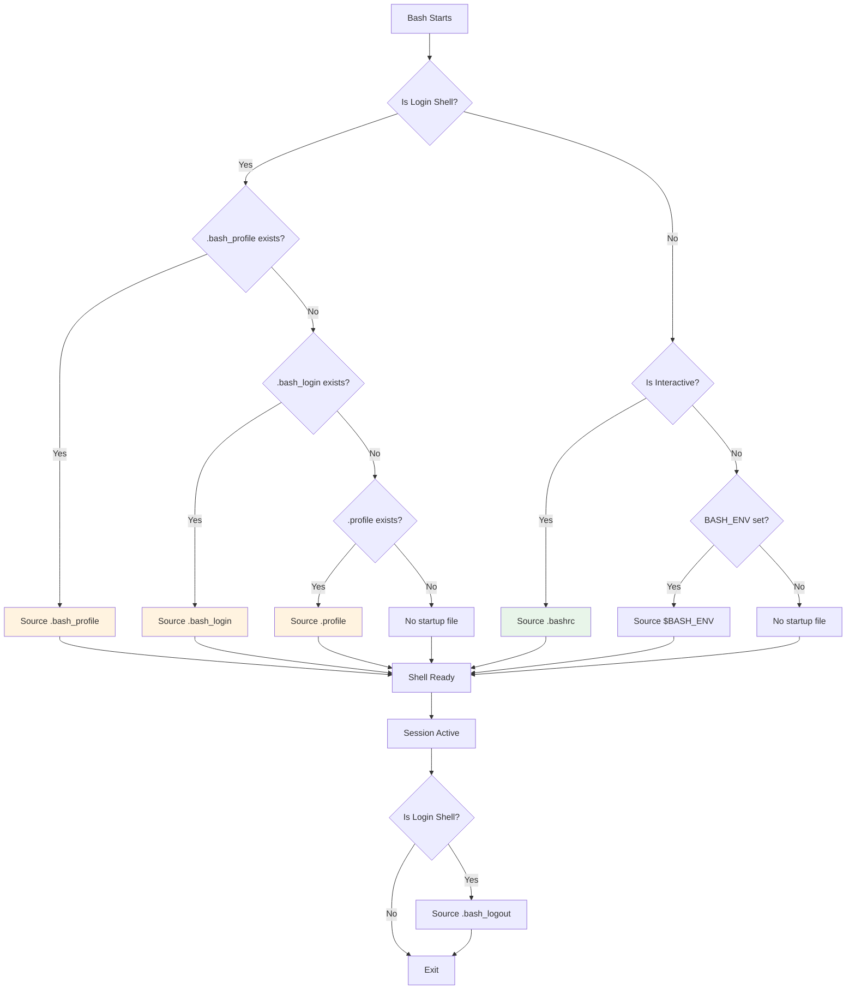

# Bash Dotfiles Overview

Bash (Bourne Again Shell) uses a series of configuration files that are sourced depending on the type of shell session. Unlike Zsh, Bash has different behavior for login vs non-login shells, and for interactive vs non-interactive shells.

## Startup File Summary

| File | When Sourced | Primary Use |
|------|--------------|-------------|
| `.bash_profile` | Login shells | Session initialization, environment |
| `.bash_login` | Login shells (fallback) | Alternative to `.bash_profile` |
| `.profile` | Login shells (fallback) | POSIX-compatible session setup |
| `.bashrc` | Interactive non-login shells | Aliases, functions, prompt |
| `.bash_logout` | Login shell exit | Cleanup tasks |

## Load Order Diagram



## Key Differences from Zsh

| Aspect | Bash | Zsh |
|--------|------|-----|
| Login shell files | Only ONE of `.bash_profile`, `.bash_login`, or `.profile` | Both `.zprofile` AND `.zlogin` |
| Interactive non-login | Only `.bashrc` | `.zshenv` AND `.zshrc` |
| Always-sourced file | None (unless `$BASH_ENV` set) | `.zshenv` |
| Login shell sources `.bashrc`? | No (manual) | Yes (auto for `.zshrc`) |

## The Login Shell Problem

**Critical Bash quirk**: Login shells do NOT automatically source `.bashrc`. This means:

- Opening a terminal (login shell): `.bash_profile` is read, but NOT `.bashrc`
- Opening a subshell: `.bashrc` is read, but NOT `.bash_profile`

**Solution**: Source `.bashrc` from `.bash_profile`:

```bash
# In .bash_profile
if [ -f ~/.bashrc ]; then
    source ~/.bashrc
fi
```

## File Locations

Bash looks for dotfiles in your home directory (`$HOME`):

```
~/.bash_profile   # Login shell initialization
~/.bash_login     # Fallback if .bash_profile missing
~/.profile        # Fallback if both above missing (POSIX)
~/.bashrc         # Interactive shell configuration
~/.bash_logout    # Login shell cleanup
```

### System Files

System-wide files are sourced first:

| File | Description |
|------|-------------|
| `/etc/profile` | System-wide login shell setup |
| `/etc/bash.bashrc` | System-wide interactive config (Debian/Ubuntu) |
| `/etc/bashrc` | System-wide interactive config (RHEL/Fedora) |

## Quick Reference

### What Goes Where?

```
.bash_profile → Environment variables, PATH, session setup, source .bashrc
.bashrc       → Aliases, functions, prompt, shell options, completions
.bash_logout  → Clear screen, cleanup temp files
.profile      → POSIX-compatible environment (for sh compatibility)
```

### Common Pattern

Most users should use this setup:

**~/.bash_profile**:
```bash
# Load environment
export EDITOR="vim"
export PATH="$HOME/bin:$PATH"

# Then load interactive config
[[ -f ~/.bashrc ]] && source ~/.bashrc
```

**~/.bashrc**:
```bash
# Interactive-only features
alias ll='ls -la'
PS1='\u@\h:\w\$ '
```

## Shell Types Explained

### Login Shell

A shell that is started as the first process for a user session:

```bash
# Check if current shell is a login shell
shopt -q login_shell && echo "Login shell" || echo "Non-login shell"

# Or check $0
echo $0  # Shows "-bash" for login shell, "bash" for non-login
```

### Interactive Shell

A shell that reads from and writes to a terminal:

```bash
# Check if interactive
[[ $- == *i* ]] && echo "Interactive" || echo "Non-interactive"
```

### Non-Interactive Shell

A shell running a script:

```bash
#!/bin/bash
# This runs in a non-interactive shell
echo "Running script"
```

## macOS vs Linux

### macOS

- Terminal.app starts **login shells** by default
- Each new window = new login shell
- `.bash_profile` is the primary file

### Linux

- Typical terminal emulators start **non-login interactive shells**
- Login happens at display manager or tty
- `.bashrc` is the primary file for terminals

**Cross-platform solution**: Always source `.bashrc` from `.bash_profile`:

```bash
# .bash_profile
[[ -f ~/.bashrc ]] && source ~/.bashrc
```

## File Documentation

- [.bash_profile](./bash_profile.mdx) - Login shell initialization
- [.bashrc](./bashrc.mdx) - Interactive shell configuration
- [.bash_login](./bash_login.mdx) - Alternative login setup
- [.bash_logout](./bash_logout.mdx) - Login shell cleanup
- [.profile](./profile.mdx) - POSIX-compatible fallback

## Best Practices

1. **Always source `.bashrc` from `.bash_profile`** - Ensures consistent experience
2. **Put environment variables in `.bash_profile`** - They persist in subshells
3. **Put interactive features in `.bashrc`** - Aliases, prompt, functions
4. **Don't create both `.bash_profile` and `.bash_login`** - Confusing and unnecessary
5. **Use `.profile` only for POSIX compatibility** - When you need sh/dash support

## References

- [Bash Reference Manual: Startup Files](https://www.gnu.org/software/bash/manual/bash.html#Bash-Startup-Files)
- [Bash Guide: Startup Files](https://mywiki.wooledge.org/DotFiles)
- [POSIX Shell Startup](https://pubs.opengroup.org/onlinepubs/9699919799/utilities/V3_chap02.html)
