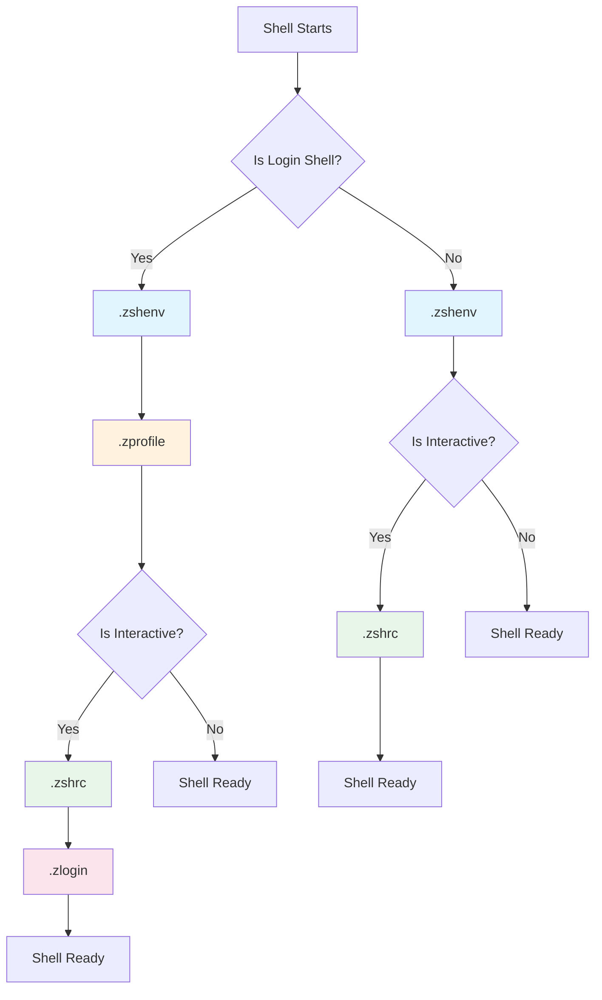
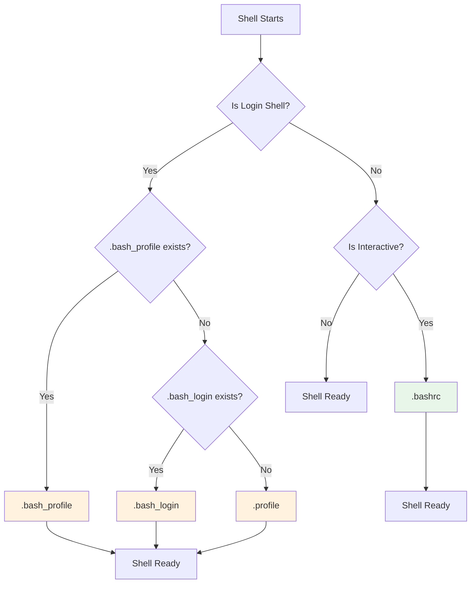

# Shell Dotfiles Reference

This reference guide documents the configuration files (dotfiles) used by **Bash** and **Zsh** shells. Understanding when and how these files are loaded is essential for properly configuring your shell environment.

## Quick Comparison

| Purpose | Zsh | Bash |
|---------|-----|------|
| Environment variables (all shells) | `.zshenv` | — |
| Login shell setup (early) | `.zprofile` | `.bash_profile` / `.profile` |
| Interactive shell config | `.zshrc` | `.bashrc` |
| Login shell setup (late) | `.zlogin` | `.bash_login` |
| Login shell cleanup | `.zlogout` | `.bash_logout` |

## Load Order Overview

### Zsh Startup Sequence



**Zsh Login Shell**: `.zshenv` → `.zprofile` → `.zshrc` → `.zlogin`

**Zsh Interactive (non-login)**: `.zshenv` → `.zshrc`

**Zsh Non-interactive**: `.zshenv` only

### Bash Startup Sequence



**Bash Login Shell**: `.bash_profile` OR `.bash_login` OR `.profile` (first found)

**Bash Interactive (non-login)**: `.bashrc` only

**Bash Non-interactive**: No startup files (unless `$BASH_ENV` is set)

## Shell Types Explained

### Login Shell

A login shell is started when you:

- Log in to a system via SSH
- Open a new terminal window (on macOS)
- Use `su -` or `login`
- Start a shell with `--login` or `-l` flag

### Interactive Shell

An interactive shell is one where you type commands and receive output. It's started when you:

- Open a terminal emulator
- Run `bash` or `zsh` without a script argument

### Non-Interactive Shell

A non-interactive shell runs scripts without user interaction:

- Running a shell script (`./script.sh`)
- Commands executed via `ssh user@host 'command'`
- Subshells spawned by programs

## Common Configuration Patterns

### Pattern 1: Consistent Environment

Source your interactive config from login files to ensure consistency:

**Bash** (in `.bash_profile`):
```bash
# Load .bashrc for interactive features
if [ -f ~/.bashrc ]; then
    source ~/.bashrc
fi
```

**Zsh** (in `.zprofile`):
```zsh
# Not typically needed - Zsh loads .zshrc automatically for interactive login shells
```

### Pattern 2: Shared Configuration

Use shell-agnostic files for settings that work in both Bash and Zsh:

```bash
# ~/.profile or ~/.shenv
export EDITOR="vim"
export PAGER="less"
export PATH="$HOME/bin:$PATH"
```

Then source from shell-specific files:

```bash
# In .bashrc or .zshrc
[ -f ~/.shenv ] && source ~/.shenv
```

## Shell-Specific Documentation

### Zsh

- [Zsh Overview](./zsh/index.mdx) - Complete guide to Zsh dotfiles
- [.zshenv](./zsh/zshenv.mdx) - Environment for all shells
- [.zprofile](./zsh/zprofile.mdx) - Login shell setup
- [.zshrc](./zsh/zshrc.mdx) - Interactive shell config
- [.zlogin](./zsh/zlogin.mdx) - Post-setup login commands
- [.zlogout](./zsh/zlogout.mdx) - Login shell cleanup

### Bash

- [Bash Overview](./bash/index.mdx) - Complete guide to Bash dotfiles
- [.bash_profile](./bash/bash_profile.mdx) - Login shell initialization
- [.bashrc](./bash/bashrc.mdx) - Interactive shell config
- [.bash_login](./bash/bash_login.mdx) - Alternative login setup
- [.bash_logout](./bash/bash_logout.mdx) - Login shell cleanup
- [.profile](./bash/profile.mdx) - POSIX-compatible fallback

## References

- [Zsh Documentation](https://zsh.sourceforge.io/Doc/)
- [Bash Reference Manual](https://www.gnu.org/software/bash/manual/bash.html)
- [Unix StackExchange: Zsh Startup Files](https://unix.stackexchange.com/questions/71253/what-should-shouldnt-go-in-zshenv-zshrc-zlogin-zprofile-zlogout)
- [Apple StackExchange: Zsh Configuration](https://apple.stackexchange.com/questions/388622/zsh-zprofile-zshrc-zlogin-what-goes-where)
