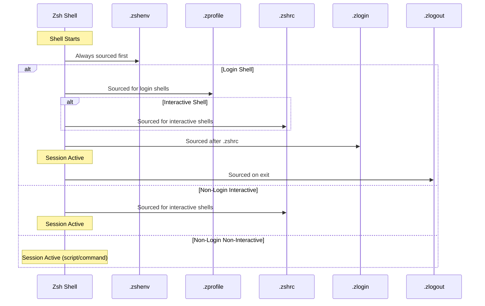

# Zsh Dotfiles Overview

Zsh (Z Shell) uses a series of configuration files that are sourced in a specific order depending on the type of shell session. This guide explains each file and when to use it.

## Startup File Summary

| File | When Sourced | Primary Use |
|------|--------------|-------------|
| `.zshenv` | Always (every invocation) | Environment variables |
| `.zprofile` | Login shells (before `.zshrc`) | Session initialization |
| `.zshrc` | Interactive shells | Aliases, functions, prompt |
| `.zlogin` | Login shells (after `.zshrc`) | Post-setup commands |
| `.zlogout` | Login shell exit | Cleanup tasks |

## Load Order Diagram



## File Locations

Zsh looks for dotfiles in these locations (in order of precedence):

1. **`$ZDOTDIR/`** - If set, Zsh looks here instead of `$HOME`
2. **`$HOME/`** - Default location (your home directory)
3. **`/etc/zsh/`** - System-wide defaults (read before user files)

### System Files

These are sourced before user files:

| File | Description |
|------|-------------|
| `/etc/zsh/zshenv` | System-wide environment |
| `/etc/zsh/zprofile` | System-wide login setup |
| `/etc/zsh/zshrc` | System-wide interactive config |
| `/etc/zsh/zlogin` | System-wide login commands |
| `/etc/zsh/zlogout` | System-wide logout cleanup |

## Quick Reference

### What Goes Where?

```
.zshenv     → PATH, EDITOR, PAGER, ZDOTDIR, language settings
.zprofile   → Commands that take time, one-time session setup
.zshrc      → Aliases, functions, prompt, completions, key bindings
.zlogin     → Welcome message, session info, external services
.zlogout    → Clear screen, temp file cleanup, session logging
```

### Common Patterns

**Setting Environment Variables** (in `.zshenv`):
```zsh
export EDITOR="nvim"
export VISUAL="$EDITOR"
export PAGER="less"
export LANG="en_US.UTF-8"

# Extend PATH
typeset -U path  # Unique entries only
path=(
    $HOME/.local/bin
    $HOME/bin
    $path
)
```

**Interactive Configuration** (in `.zshrc`):
```zsh
# Aliases
alias ll='ls -lah'
alias gs='git status'

# Prompt
PROMPT='%F{cyan}%n@%m%f:%F{yellow}%~%f$ '

# History
HISTSIZE=10000
SAVEHIST=10000
HISTFILE=~/.zsh_history

# Enable features
setopt AUTO_CD
setopt CORRECT
setopt SHARE_HISTORY
```

**Login Message** (in `.zlogin`):
```zsh
# Display system info on login
echo "Welcome to $(hostname)"
echo "Uptime: $(uptime | sed 's/.*up //' | sed 's/,.*//')"
```

## Determining Shell Type

You can check what type of shell you're in:

```zsh
# Check if login shell
if [[ -o login ]]; then
    echo "This is a login shell"
fi

# Check if interactive
if [[ -o interactive ]]; then
    echo "This is an interactive shell"
fi

# Show all options
setopt  # Lists enabled options
```

## File Documentation

- [.zshenv](./zshenv.mdx) - Environment variables for all shell types
- [.zprofile](./zprofile.mdx) - Login shell initialization
- [.zshrc](./zshrc.mdx) - Interactive shell configuration
- [.zlogin](./zlogin.mdx) - Post-setup login commands
- [.zlogout](./zlogout.mdx) - Login shell cleanup

## Best Practices

1. **Keep `.zshenv` minimal** - It runs for every shell, including scripts
2. **Don't output in `.zshenv`** - It breaks tools that parse shell output
3. **Use `.zshrc` for most config** - It's the most commonly sourced file
4. **Choose `.zprofile` OR `.zlogin`** - They serve similar purposes
5. **Test with fresh shells** - Use `zsh --login` or `zsh -i` to verify

## References

- [Zsh User Guide: Startup Files](https://zsh.sourceforge.io/Guide/zshguide02.html)
- [Zsh Manual: Files](https://zsh.sourceforge.io/Doc/Release/Files.html)
- [Unix StackExchange: Zsh Startup Files](https://unix.stackexchange.com/questions/71253/what-should-shouldnt-go-in-zshenv-zshrc-zlogin-zprofile-zlogout)
